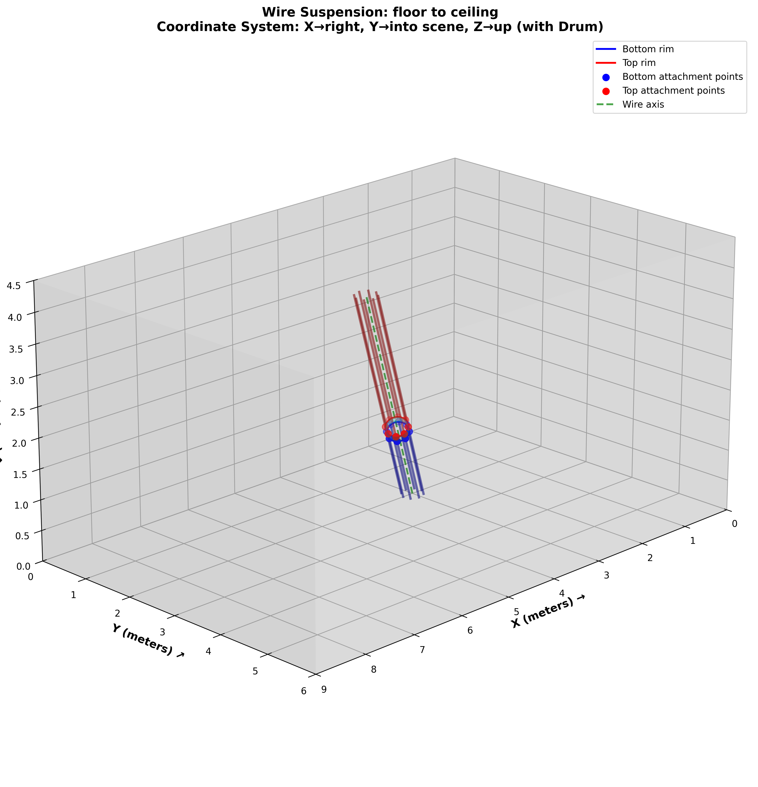

# Drum Suspension Calculator

A Python tool for calculating precise wire anchor points to suspend cylindrical objects (drums, sculptures, etc.) within a rectangular space using tensioned wires attached to room surfaces.



## Table of Contents

- [Overview](#overview)
- [Features](#features)
- [Installation](#installation)
- [Quick Start](#quick-start)
- [Coordinate System](#coordinate-system)
- [Usage](#usage)
- [Template Mirroring](#template-mirroring)
- [Examples](#examples)
- [Output Files](#output-files)
- [Understanding the Math](#understanding-the-math)
- [Troubleshooting](#troubleshooting)
- [Advanced Usage](#advanced-usage)
- [Contributing](#contributing)
- [License](#license)

---

## Overview

This tool solves a common problem in art installations, stage design, and acoustic engineering: **how to suspend a cylindrical object at an arbitrary angle within a rectangular room**.

Given:
- A rectangular room (hall/gallery) with known dimensions
- Two anchor points on room surfaces (walls, floor, ceiling)
- Drum specifications (diameter, depth)

The calculator outputs:
- Exact 3D coordinates for all wire attachment points
- Printable 1:1 scale drilling templates for each surface
- 3D visualization of the complete suspension system

### Real-World Applications

- **Art Installations**: Suspending drums, sculptures, or kinetic art
- **Stage Design**: Theatrical rigging calculations
- **Acoustic Engineering**: Positioning resonant objects in studios
- **Architecture**: Suspended element design and validation
- **DIY Projects**: Custom hanging solutions with precise measurements

---

## Features

✨ **Automatic Face Detection**: Just specify 3D coordinates - the system automatically detects which room surface you're referencing

📐 **1:1 Scale Templates**: Print and use directly for drilling - no scaling required

🔄 **Smart Mirroring**: Templates are automatically mirrored for inside-cube installation perspective

🎯 **Precise Calculations**: Handles arbitrary orientations and positions with sub-millimeter accuracy

📊 **Multiple Formats**: Outputs PNG, SVG, and PDF for different use cases

🎨 **3D Visualization**: Interactive 3D preview of the complete installation

⚙️ **Flexible Configuration**: Customize drum size, attachment points, and positioning

---

## Installation

### Requirements

- Python 3.7+
- pip package manager

### Dependencies
```bash
pip install numpy matplotlib scipy
```

Or install all at once:
```bash
pip install -r requirements.txt
```

### Project Structure
```
drum-suspension-calculator/
├── suspension_calculator.py    # Main script
├── requirements.txt            # Python dependencies
├── README.md                   # This file
└── data/
    └── results/               # Output directory (auto-created)
        └── project_name_timestamp/
            ├── coordinates.txt
            ├── floor_template.png/svg/pdf
            ├── ceiling_template.png/svg/pdf
            └── 3d_visualization.png
```

---

## Quick Start

### Basic Example: Floor to Ceiling Suspension

Suspend a 17" tom drum from floor to ceiling:
```bash
python suspension_calculator.py \
  --name "my_first_drum" \
  --start 3.0 4.5 0.0 \
  --end 5.3 5.8 4.5
```

This creates:
- Drilling templates for floor and ceiling
- 3D visualization
- Complete coordinate listing

**Output location**: `data/results/my_first_drum_<timestamp>/`

---

## Coordinate System

Understanding the coordinate system is crucial for correct usage.

### Origin and Axes
```
        Z ↑ (height)
        |
        |
        |________→ X (right, toward back wall)
       /
      /
     ↙ Y (into scene, toward lateral wall)
```

**Origin**: Left corner at floor level (0, 0, 0)

**Axes**:
- **X-axis**: Horizontal, going RIGHT (toward back wall)
  - Range: 0 to 9.0 meters (default)
- **Y-axis**: Horizontal, going INTO THE SCENE (toward lateral wall)
  - Range: 0 to 6.0 meters (default)
- **Z-axis**: Vertical, going UP (height)
  - Range: 0 to 4.5 meters (default)

### Room Dimensions (Configurable)

Default hall dimensions (edit constants in code if needed):
```python
HALL_X_MAX = 9.0   # meters - back wall
HALL_Y_MAX = 6.0   # meters - lateral wall
HALL_Z_MAX = 4.5   # meters - ceiling
```

### Face Names and Locations

| Face Name | Location | Equation | Description |
|-----------|----------|----------|-------------|
| `floor` | Bottom | z = 0 | Floor surface |
| `ceiling` | Top | z = 4.5 | Ceiling surface |
| `wall_x0` | Left | x = 0 | Left wall |
| `wall_x_max` | Right/Back | x = 9.0 | Back wall |
| `wall_y0` | Front | y = 0 | Front wall |
| `wall_y_max` | Lateral | y = 6.0 | Lateral wall (into scene) |

### Viewing Perspective

When inside the room:
- Standing at origin, you face in the **+X, +Y direction**
- Looking at `wall_x0` (left wall): you face **RIGHT** (+X direction)
- Looking at `wall_x_max` (back wall): you face **LEFT** (toward origin)
- Looking at `wall_y0` (front wall): you face **FORWARD** (+Y direction)
- Looking at `wall_y_max` (lateral wall): you face **BACK** (toward origin)

---

## Usage

### Command Line Syntax
```bash
python suspension_calculator.py [OPTIONS]
```

### Required Arguments

| Argument | Short | Description | Example |
|----------|-------|-------------|---------|
| `--name` | `-n` | Project name for output | `"tom_17_test"` |
| `--start` | `-s` | Start point (X Y Z) in meters | `3.0 4.5 0.0` |
| `--end` | `-e` | End point (X Y Z) in meters | `5.3 5.8 4.5` |

### Optional Arguments

| Argument | Short | Default | Description |
|----------|-------|---------|-------------|
| `--diameter` | `-d` | 0.4318 | Drum diameter in meters (17" tom) |
| `--depth` | | 0.40 | Drum depth in meters |
| `--position` | `-p` | 0.33 | Bottom rim position along axis (0-1) |
| `--num-points` | | 8 | Attachment points per rim (min 3) |
| `--no-cylinder` | | False | Show only wires, hide cylinder |

### Understanding `--position`

The `--position` parameter (0.0 to 1.0) determines where the drum's **bottom rim** is positioned along the suspension axis:
```
Start Point (0.0) ●━━━━━━━━━━━━━━━━━━━━━━━━━━━━━● End Point (1.0)
                       ↑
                  position = 0.33
                  (bottom rim here)
```

- `0.0`: Bottom rim at start point
- `0.5`: Bottom rim at midpoint
- `1.0`: Bottom rim at end point (drum extends beyond)

The drum extends from this position along the axis for a distance equal to `--depth`.

---

## Template Mirroring

### Why Mirroring is Necessary

When you print a template and physically attach it to a surface **from inside the room**, you need coordinates that match your viewing perspective.

**Problem**: Mathematical coordinates are calculated as if viewing from outside the cube.

**Solution**: Templates are automatically mirrored based on which face you're viewing and from which direction.

### Mirroring Rules

| Face | View Direction | Horizontal Mirror | Vertical Mirror | Note |
|------|----------------|-------------------|-----------------|------|
| `floor` | Looking DOWN | ❌ No | ❌ No | Natural view |
| `ceiling` | Looking UP | ❌ No | ✅ **Yes** | Viewing underside |
| `wall_x0` | Looking RIGHT | ❌ No | ❌ No | Natural view |
| `wall_x_max` | Looking LEFT | ✅ **Yes** | ❌ No | Facing origin |
| `wall_y0` | Looking FORWARD | ❌ No | ❌ No | Natural view |
| `wall_y_max` | Looking BACK | ✅ **Yes** | ❌ No | Facing origin |

### Visual Example

**Without Mirroring (Incorrect)**:
```
Template shows:        Physical reality:
    ●                      ●
  ●   ●                  ●   ●
    ●                      ●
(Doesn't match!)      (Mirror image)
```

**With Mirroring (Correct)**:
```
Template shows:        Physical reality:
    ●                      ●
  ●   ●                  ●   ●
    ●                      ●
(Perfect match!)       (Same orientation)
```

### Template Warning Labels

Each template includes a warning label showing mirroring status:

- ⚠️ **"No mirroring applied - natural viewing perspective"**
- ⚠️ **"Horizontal axis MIRRORED - for inside-cube installation"**
- ⚠️ **"Vertical axis MIRRORED - for inside-cube installation"**

---

## Examples

### Example 1: Simple Floor-to-Ceiling (17" Tom Drum)

**Scenario**: Suspend a standard 17" tom drum vertically from floor to ceiling in the center of the room.
```bash
python suspension_calculator.py \
  --name "tom_17_vertical" \
  --start 4.5 3.0 0.0 \
  --end 4.5 3.0 4.5
```

**Explanation**:
- Start: Center of floor (X=4.5, Y=3.0, Z=0.0)
- End: Directly above at ceiling (X=4.5, Y=3.0, Z=4.5)
- Drum: Default 17" tom (diameter=0.4318m, depth=0.40m)
- Result: 8 wires from floor, 8 from ceiling, perfectly vertical

**Faces detected**: `floor` → `ceiling`

---

### Example 2: Diagonal Wall-to-Wall Suspension

**Scenario**: Suspend drum at an angle from left wall to back wall.
```bash
python suspension_calculator.py \
  --name "diagonal_wall" \
  --start 0.0 3.0 2.0 \
  --end 9.0 5.0 3.0 \
  --diameter 0.5 \
  --depth 0.45 \
  --num-points 10
```

**Explanation**:
- Start: Left wall (X=0.0), mid-depth (Y=3.0), mid-height (Z=2.0)
- End: Back wall (X=9.0), toward lateral wall (Y=5.0), higher (Z=3.0)
- Custom drum: 50cm diameter, 45cm depth
- 10 attachment points per rim for more support

**Faces detected**: `wall_x0` → `wall_x_max`

---

### Example 3: Tilted Front-to-Back

**Scenario**: Suspend from front wall to lateral wall with custom positioning.
```bash
python suspension_calculator.py \
  --name "front_to_lateral" \
  --start 4.0 0.0 2.5 \
  --end 6.0 6.0 3.5 \
  --position 0.4 \
  --num-points 6
```

**Explanation**:
- Start: Front wall (Y=0.0) at X=4.0, Z=2.5
- End: Lateral wall (Y=6.0) at X=6.0, Z=3.5
- Bottom rim at 40% along axis (closer to front)
- Only 6 attachment points (lighter drum)

**Faces detected**: `wall_y0` → `wall_y_max`

---

### Example 4: Wires Only (No Cylinder Visualization)

**Scenario**: Visualize just the wire pattern without the drum, useful for planning or when drum is irregular.
```bash
python suspension_calculator.py \
  --name "wire_pattern_only" \
  --start 2.0 2.0 0.0 \
  --end 7.0 4.0 4.5 \
  --no-cylinder
```

**Explanation**:
- `--no-cylinder` flag hides the drum in 3D visualization
- Templates still generated normally
- Useful for abstract wire installations

---

### Example 5: Small Snare Drum

**Scenario**: 14" snare drum, shallower depth.
```bash
python suspension_calculator.py \
  --name "snare_14_shallow" \
  --start 3.0 2.0 1.0 \
  --end 6.0 4.0 3.5 \
  --diameter 0.3556 \
  --depth 0.14 \
  --num-points 8
```

**Explanation**:
- 14" diameter = 0.3556 meters
- Shallow snare depth = 0.14 meters
- Standard 8 mounting points

---

### Example 6: Large Bass Drum

**Scenario**: 22" bass drum suspended at steep angle.
```bash
python suspension_calculator.py \
  --name "bass_22_steep" \
  --start 1.0 1.0 0.5 \
  --end 8.0 5.0 4.0 \
  --diameter 0.5588 \
  --depth 0.46 \
  --num-points 12 \
  --position 0.25
```

**Explanation**:
- 22" diameter = 0.5588 meters
- Deep bass drum = 0.46 meters
- 12 points for heavy drum support
- Position at 25% (more weight toward start)

---

## Output Files

Each run creates a timestamped directory with the following files:

### 1. `coordinates.txt`

Complete listing of all coordinates in multiple formats.

**Sample content**:
```
==========================================================================================
DRUM SUSPENSION - WIRE ANCHOR POINTS
==========================================================================================

COORDINATE SYSTEM:
  Origin: Left corner (0, 0, 0)
  X axis: Going right (to back wall, max=9.0)
  Y axis: Going into scene (to lateral wall, max=6.0)
  Z axis: Going up (height, max=4.5)

⚠️ TEMPLATE MIRRORING (for inside-cube installation):
  floor: No mirroring applied - natural viewing perspective
  ceiling: Vertical axis MIRRORED - for inside-cube installation

INPUT PARAMETERS:
  Project name: my_first_drum
  Start point: (3.00, 4.50, 0.00) m
  Detected face: floor
  End point: (5.30, 5.80, 4.50) m
  Detected face: ceiling
  ...

==========================================================================================
FLOOR ANCHOR POINTS
==========================================================================================
Reference center: (3.0000, 4.5000)
------------------------------------------------------------------------------------------
Point    3D X (m)     3D Y (m)     3D Z (m)     2D X (m)        2D Y (m)        
------------------------------------------------------------------------------------------
1        3.2159       4.5000       0.0000       3.2159          4.5000          
2        3.1527       4.6527       0.0000       3.1527          4.6527          
...
```

### 2. Template Files (Per Face)

Each face gets three formats:
- `{face_name}_template.png` - Raster image (100 DPI)
- `{face_name}_template.svg` - Vector graphics (scalable)
- `{face_name}_template.pdf` - Print-ready PDF

**Template features**:
- 1:1 scale (can be printed directly)
- Numbered anchor points with coordinates
- Origin marked with blue X
- Grid for alignment
- Smooth curve showing intersection ellipse
- Mirroring status warning

### 3. `3d_visualization.png`

Complete 3D rendering showing:
- Room cube (transparent faces)
- Drum cylinder (if enabled)
- All suspension wires
- Color-coded elements:
  - Blue: Bottom rim and wires
  - Red: Top rim and wires
  - Green dashed: Suspension axis
  - Cyan: Drum surface

---

## Understanding the Math

### Key Concepts

#### 1. Parametric Axis Position

The suspension axis is defined by start and end points. Position along this axis is parametric (0 to 1):
```
axis_point = start + t × (end - start)

where t ∈ [0, 1]
```

The `--position` parameter determines where the drum's bottom rim sits on this axis.

#### 2. Drum Orientation

The drum's axis aligns with the suspension axis. To place attachment points around the rim:

1. Calculate perpendicular vectors to the axis
2. Form a local coordinate system
3. Distribute points evenly around circumference
```python
# Perpendicular vectors
perp1 = cross(axis, arbitrary_vector)
perp2 = cross(axis, perp1)

# Points on rim
for angle in [0, 2π]:
    point = center + radius × (cos(angle)×perp1 + sin(angle)×perp2)
```

#### 3. Wire Intersection

Each attachment point sends a wire along the axis direction (or opposite) until it hits a room surface:
```
Line: P = point + t × direction
Plane: ax + by + cz = d

Solve for t, then calculate intersection point
```

#### 4. 2D Projection

3D intersection points are projected onto 2D face coordinates:

- **Floor/Ceiling**: (X, Y) projection
- **X-walls**: (Y, Z) projection  
- **Y-walls**: (X, Z) projection

#### 5. Mirroring Transform

For inside-cube perspective:
```python
if horizontal_mirror:
    x' = -x
if vertical_mirror:
    y' = -y
```

Applied after converting to relative coordinates (center = origin).

---

## Troubleshooting

### Common Issues

#### ❌ "Point is not on any cube face"

**Problem**: Coordinates don't lie exactly on a room surface.

**Solution**: Ensure at least one coordinate matches a face boundary exactly:
- Floor: Z = 0.0
- Ceiling: Z = 4.5
- Walls: X = 0.0 or 9.0, Y = 0.0 or 6.0
```bash
# ❌ Wrong - point is floating in space
--start 3.0 4.5 0.1  # Z should be 0.0

# ✅ Correct
--start 3.0 4.5 0.0
```

#### ❌ "Point is at [face] but outside bounds"

**Problem**: Point is on the correct plane but outside room dimensions.

**Solution**: Check that coordinates are within valid ranges:
- X: [0, 9.0]
- Y: [0, 6.0]
- Z: [0, 4.5]
```bash
# ❌ Wrong - Y is outside room
--start 3.0 6.5 0.0  # Y max is 6.0

# ✅ Correct
--start 3.0 6.0 0.0
```

#### ⚠️ "Anchor points outside bounds and will be skipped"

**Problem**: Some wire intersections fall outside the target face.

**Causes**:
- Drum too large for the angle
- Extreme tilt angle
- Position parameter creates geometry where wires miss the face

**Solutions**:
1. Reduce drum diameter: `--diameter 0.35`
2. Adjust position: `--position 0.5`
3. Change start/end points to be more aligned
4. Reduce number of points: `--num-points 6`

#### 📏 Template Prints at Wrong Scale

**Problem**: Template doesn't match 1:1 scale when printed.

**Solution**: 
1. Check PDF print settings: "Actual Size" not "Fit to Page"
2. Verify DPI: Should be 100 DPI for PNG
3. Measure grid squares: Should be actual meters

#### 🔄 Template Appears Backwards

**Problem**: Drilled holes don't align with physical setup.

**Verification**:
1. Check template title for mirroring note
2. Ensure you're installing from **inside** the cube
3. Verify face name matches physical location

**Quick test**: Print template, hold against wall from inside room. The origin (center blue X) should align with your calculated center point.

---

## Advanced Usage

### Modifying Room Dimensions

Edit constants at top of script:
```python
# ========== CONSTANTS ==========
HALL_X_MAX = 12.0   # Larger room: 12m × 8m × 5m
HALL_Y_MAX = 8.0
HALL_Z_MAX = 5.0
```

### Custom Drum Diameters (Common Sizes)
```python
# Drum diameter conversions
8"  = 0.2032 m
10" = 0.254 m
12" = 0.3048 m
13" = 0.3302 m
14" = 0.3556 m
16" = 0.4064 m
18" = 0.4572 m
20" = 0.508 m
22" = 0.5588 m
24" = 0.6096 m
```

### Batch Processing Multiple Drums

Create a shell script:
```bash
#!/bin/bash

# Suspend 3 toms in formation
python suspension_calculator.py \
  --name "tom_high" --start 2.0 2.0 0.0 --end 4.0 3.0 4.5 \
  --diameter 0.3048  # 12"

python suspension_calculator.py \
  --name "tom_mid" --start 4.5 3.0 0.0 --end 6.0 4.0 4.5 \
  --diameter 0.3556  # 14"

python suspension_calculator.py \
  --name "tom_low" --start 7.0 4.0 0.0 --end 8.5 5.0 4.5 \
  --diameter 0.4064  # 16"
```

### Using Templates for Installation

**Step-by-step installation process**:

1. **Print Templates**
   - Use PDF for best quality
   - Print at "Actual Size" (100% scale)
   - Use thick paper or cardboard

2. **Mark Center Point**
   - Measure and mark the origin (blue X) on actual surface
   - Use laser level for accuracy
   - Double-check with measurements from room corners

3. **Align Template**
   - Place template with origin on marked center
   - Use tape to secure temporarily
   - Verify alignment with grid lines

4. **Transfer Points**
   - Use awl or center punch through template
   - Mark all numbered anchor points
   - Label each point with its number

5. **Drill Holes**
   - Remove template
   - Drill pilot holes at marks
   - Install anchors/hooks according to wire gauge

6. **Verify Before Hanging**
   - Measure distances between adjacent points
   - Should match template distances
   - Compare with coordinates.txt file

### Wire Length Calculation (Manual)

The script doesn't calculate wire lengths, but you can:
```python
# For each wire from coordinates.txt:
import numpy as np

# Example: Wire from floor point to drum attachment
floor_point = np.array([3.2159, 4.5000, 0.0000])
drum_point = np.array([3.1527, 4.1473, 0.4000])

wire_length = np.linalg.norm(drum_point - floor_point)
print(f"Wire length: {wire_length:.4f} meters")

# Add 10-20% extra for tensioning and adjustment
total_needed = wire_length * 1.15
```

### Tolerance Analysis

For critical installations, consider manufacturing tolerances:

- **Room measurements**: ±5mm typical
- **Printing accuracy**: ±1mm for good printer
- **Drilling precision**: ±2mm with good tools
- **Wire stretch**: Depends on material and tension

**Recommendation**: Build in 10-20mm adjustment capability in wire tensioning system.

---

## Physical Installation Tips

### Wire Selection

Choose wire based on load:
```
Drum Weight × Safety Factor = Required Breaking Strength

Safety Factor recommended: 5-10×

Example: 10kg drum, 8 wires, SF=7
Load per wire = 10kg / 8 = 1.25kg
Required strength = 1.25kg × 7 = 8.75kg ≈ 19 lbs

Use: 1mm stainless steel wire (≈200 lbs breaking strength)
```

### Tensioning

- Use turnbuckles for adjustability
- Tension all wires evenly
- Check drum level with spirit level
- Re-tension after 24 hours (initial stretch)

### Safety

⚠️ **Critical Safety Considerations**:

1. **Load Rating**: Always use hardware rated for **3-5× the actual load**
2. **Professional Review**: Have structural calculations verified by engineer for:
   - Public installations
   - Loads over 50kg
   - Spans over 3 meters
3. **Regular Inspection**: Check wires, anchors, and attachments monthly
4. **Below-Head Clearance**: Never suspend heavy objects above head height without safety barriers
5. **Test Installation**: Do initial hang with weights, not expensive drums

---

## Contributing

Contributions welcome! Areas for improvement:

- [ ] Wire tension/load calculations
- [ ] Material selection database
- [ ] Interactive GUI for point selection
- [ ] Multiple drum configurations
- [ ] Animation of assembly process
- [ ] Integration with CAD software
- [ ] Mobile app for on-site measurements
- [ ] Collision detection with room obstacles

### Development Setup
```bash
git clone https://github.com/yourusername/drum-suspension-calculator.git
cd drum-suspension-calculator
pip install -r requirements.txt
pip install -r requirements-dev.txt  # Testing tools
```

### Running Tests
```bash
python -m pytest tests/
```

---

## License

MIT License - see LICENSE file for details

---

## Credits

**Author**: [Your Name]
**Version**: 2.0.0 (with mirroring support)
**Last Updated**: 2024

### Acknowledgments

- Inspired by theatrical rigging mathematics
- Template mirroring concept from practical installation experience
- 3D visualization using matplotlib and numpy

---

## Support

- **Issues**: https://github.com/yourusername/drum-suspension-calculator/issues
- **Discussions**: https://github.com/yourusername/drum-suspension-calculator/discussions
- **Email**: your.email@example.com

---

## Changelog

### Version 2.0.0 (Current)
- ✨ Added automatic template mirroring for inside-cube installation
- 📝 Enhanced documentation with detailed mirroring explanation
- 🐛 Fixed coordinate projection for opposite-facing walls
- ⚡ Improved template rendering with mirroring notes

### Version 1.0.0
- 🎉 Initial release
- ✅ Automatic face detection
- ✅ 1:1 scale template generation
- ✅ 3D visualization
- ✅ Multi-format output (PNG/SVG/PDF)

---

## FAQ

**Q: Can I use this for non-cylindrical objects?**
A: The math assumes cylindrical geometry. For other shapes, you'd need to modify the attachment point calculation logic.

**Q: What if my room isn't perfectly rectangular?**
A: This tool assumes perfect rectangular geometry. For irregular rooms, consider using the closest rectangular approximation or multiple calculations for different zones.

**Q: How accurate do my measurements need to be?**
A: ±5mm is generally acceptable. The templates include adjustment recommendations.

**Q: Can I suspend multiple drums from the same wire system?**
A: Not directly. Each drum needs its own calculation. However, you can design a compound system by running the calculator multiple times with different parameters.

**Q: What about dynamic loads (swinging, vibration)?**
A: This tool calculates static geometry only. Dynamic loads require additional engineering analysis. Consult a structural engineer for performance applications.

**Q: The 3D visualization doesn't show - why?**
A: Ensure you have matplotlib with 3D support: `pip install matplotlib --upgrade`

**Q: Can I modify the mirroring rules?**
A: Yes! Edit the `should_mirror_template()` function if your installation perspective differs.

---

## Quick Reference Card
```
┌─────────────────────────────────────────────────────────────┐
│                    QUICK REFERENCE                          │
├─────────────────────────────────────────────────────────────┤
│ BASIC COMMAND:                                              │
│ python suspension_calculator.py -n NAME -s X Y Z -e X Y Z   │
│                                                             │
│ COORDINATE SYSTEM:                                          │
│ X → Right (0-9m)  Y → Into scene (0-6m)  Z → Up (0-4.5m)  │
│                                                             │
│ FACES:                                                      │
│ floor: z=0  ceiling: z=4.5  wall_x0: x=0  wall_x_max: x=9  │
│ wall_y0: y=0  wall_y_max: y=6                              │
│                                                             │
│ COMMON DRUM SIZES:                                          │
│ 12" = 0.3048m   14" = 0.3556m   16" = 0.4064m             │
│ 17" = 0.4318m (default)   20" = 0.508m   22" = 0.5588m    │
│                                                             │
│ MIRRORING (automatic):                                      │
│ ceiling, wall_x_max, wall_y_max = MIRRORED                 │
│ floor, wall_x0, wall_y0 = NOT MIRRORED                     │
└─────────────────────────────────────────────────────────────┘
```

---

**Happy Suspending! 🥁✨**
